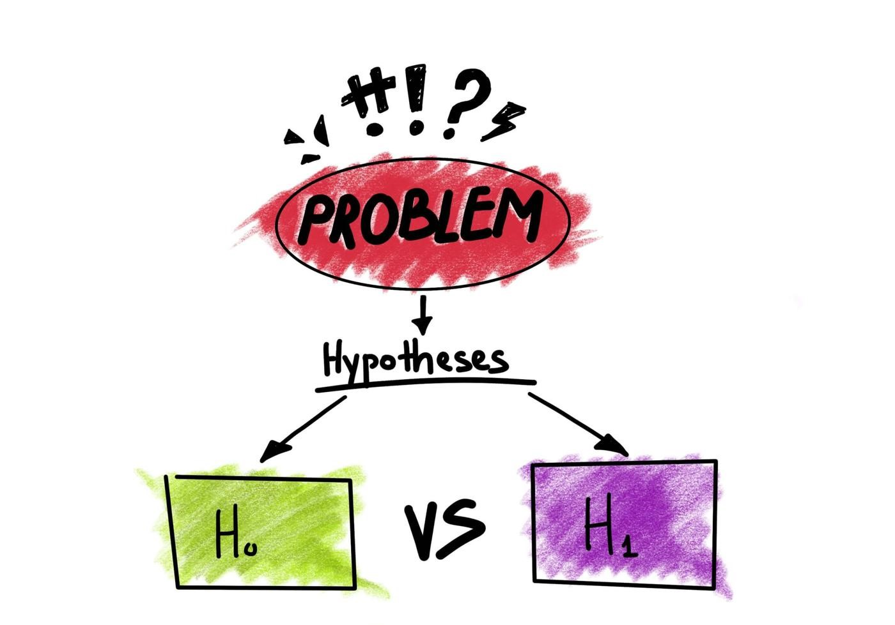

## <strong>HYPOTHESIS TESTING</strong> 
**Hypothesis testing** is a form of statistical inference that uses data from a sample to draw conclusions about a population parameter or a population probability distribution

 
## <strong> STEPS </strong>
There are 5 main steps in hypothesis testing:
- State your research Null hypothesis.
- Then alternate hypothesis.
- Collect data in a way  designed to tes and hypothesis.
- Perform an appropriate statistical test.
- Decide whether to reject or fail to reject Your Null hypothesis.
 

### AUTHOR

<strong>Mahnoor Rana</strong>

You can get in touch with me on my LinkedIn Profile:

You can also follow my GitHub Profile to stay updated about my latest projects:

If you liked the repo then kindly support it by giving it a star ⭐.